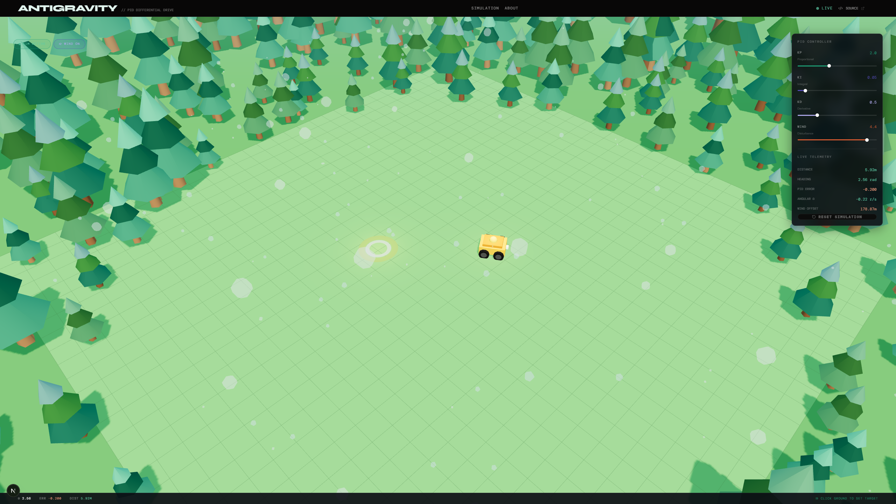
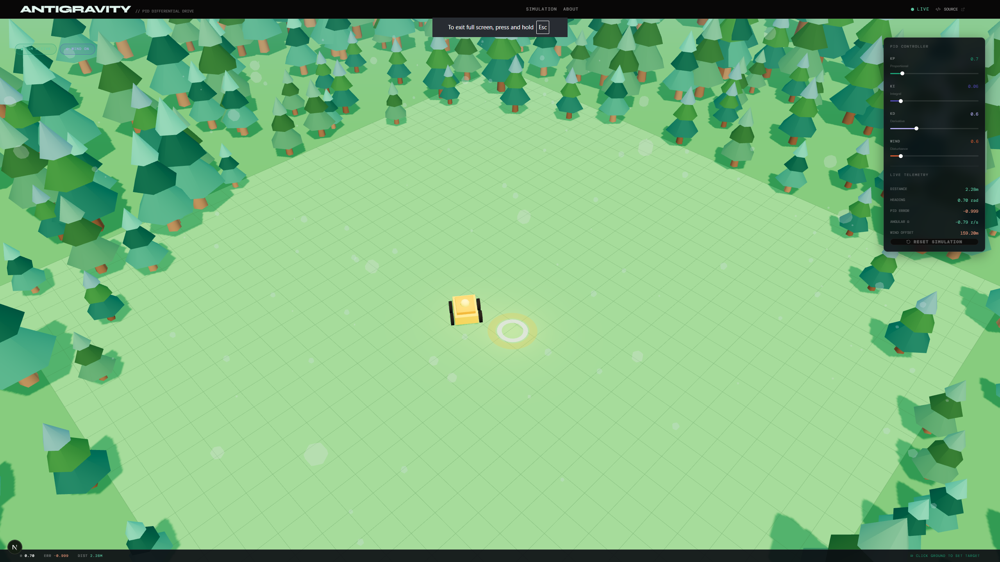
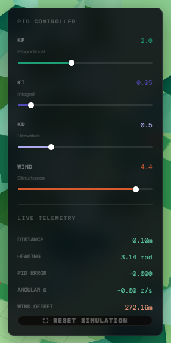

# ANTIGRAVITY // PID Differential Drive

> An interactive 3D web simulation that turns abstract control theory into a
> tactile experience. Tune a real PID controller and watch a differential drive
> robot fight wind disturbances in real time.



[](https://nextjs.org)
[](https://threejs.org)
[](https://typescriptlang.org)
[](LICENSE)

---

## What Is This?

Most people learn PID control through equations. This project lets you
**feel** it instead.

A low-poly differential drive robot sits in an isometric 3D forest
environment. Wind constantly pushes it off its target position (the setpoint).
You control the three PID gains — `Kp`, `Ki`, `Kd` — via live sliders and
watch how the robot's behaviour changes in real time:

- **Too much Kp** → the robot overcorrects and oscillates
- **Too little Kd** → the robot overshoots and wobbles
- **Ki = 0** → the robot never fully reaches the target under constant wind
  (steady-state error)

This is the same math powering my real-world ESP32 differential drive robot
(Robot GCS V2).

---

## Screenshots

| Simulation Running | Converging (well tuned) |
|---|---|
|  |  |

---

## Features

- **Real-time 3D scene** — isometric low-poly forest built entirely with
  Three.js procedural geometry, no external assets
- **Live PID heading control** — the robot computes heading error and angular
  velocity correction every frame
- **Wind disturbance system** — toggleable wind with adjustable strength,
  visualised as drifting particle streaks
- **Live telemetry panel** — distance to setpoint, heading, PID error,
  angular velocity, wind offset
- **Click-to-set target** — click anywhere on the ground plane to move the
  setpoint; the robot autonomously navigates
- **Fully typed** — TypeScript strict mode throughout, zero `any` types

---

## Tech Stack

| Layer | Technology |
|---|---|
| Framework | Next.js 16 (App Router) |
| 3D Engine | Three.js r184 |
| Language | TypeScript 5, strict mode |
| Styling | Tailwind CSS v4 + CSS custom properties |
| Fonts | Syne 800, DM Mono, Instrument Sans (Google Fonts) |
| Icons | Lucide React |
| Deployment | Google Cloud Run (Docker) |

---

## Project Structure
src/
├── app/
│   ├── layout.tsx          # Root layout, metadata, font loading
│   ├── page.tsx            # Main page composition
│   └── globals.css         # CSS variables / design tokens
├── components/
│   ├── layout/
│   │   ├── Navbar.tsx      # Top navigation bar
│   │   └── StatusBar.tsx   # Bottom telemetry strip
│   └── simulation/
│       ├── SimCanvas.tsx   # Three.js scene + PID animation loop
│       ├── PIDPanel.tsx    # Right panel: sliders + live telemetry
│       └── SimControls.tsx # Top-left: SIM ACTIVE / WIND toggle
├── lib/
│   ├── pid.ts              # Pure PID controller class (no React)
│   ├── physics.ts          # Vehicle physics, heading math, wind
│   └── utils.ts            # cn(), clamp(), angleWrap() helpers
└── hooks/
└── useSimulation.ts    # Simulation state, refs, animation loop

---

## Local Setup

### Prerequisites

- Node.js 20 or later
- npm 10 or later

### Install & Run

```bash
# 1. Clone the repository
git clone https://github.com/FireMax-Bot/PID-Simulation-Antigravity-.git
cd PID-Simulation-Antigravity-

# 2. Install dependencies
npm install

# 3. Start the development server
npm run dev
```

Open [http://localhost:3000](http://localhost:3000) in your browser.

### Build for Production

```bash
npm run build
npm start
```

### Lint & Type Check

```bash
npm run lint
npx tsc --noEmit
```

---

## Docker (Local)

```bash
# Build the image
docker build -t antigravity .

# Run the container
docker run -p 3000:3000 antigravity
```

Open [http://localhost:3000](http://localhost:3000).

---

## Deploy to Google Cloud Run

### Prerequisites

1. Install the [Google Cloud SDK](https://cloud.google.com/sdk/docs/install)
2. Authenticate: `gcloud auth login`
3. Set your project: `gcloud config set project YOUR_PROJECT_ID`
4. Enable required APIs:

```bash
gcloud services enable \
  cloudbuild.googleapis.com \
  run.googleapis.com \
  containerregistry.googleapis.com
```

### Deploy

```bash
gcloud builds submit --tag gcr.io/YOUR_PROJECT_ID/antigravity

gcloud run deploy antigravity \
  --image gcr.io/YOUR_PROJECT_ID/antigravity \
  --platform managed \
  --region us-central1 \
  --allow-unauthenticated \
  --port 3000 \
  --memory 512Mi
```

Replace `YOUR_PROJECT_ID` with your actual GCP project ID. After deployment,
Cloud Run provides a live HTTPS URL.

---

## How PID Control Works (Quick Reference)
error(t)  =  setpoint  −  current_position
u(t)  =  Kp · error  +  Ki · ∫error dt  +  Kd · d(error)/dt
───────────    ─────────────    ──────────────────
Proportional     Integral           Derivative
(react now)   (fix drift)        (prevent overshoot)

| Gain | Effect | Too Low | Too High |
|---|---|---|---|
| `Kp` | Immediate correction strength | Sluggish | Oscillates |
| `Ki` | Eliminates steady-state error | Constant drift | Wind-up / instability |
| `Kd` | Damping / anticipatory brake | Overshoot | Twitchy / noisy |

---

## About

Built by **Noel Isaac Aj** — BTech Robotics & Automation.

This simulation is the software companion to my real-world differential drive
robot project (Robot GCS V2), which uses an ESP32, overhead ArUco marker
tracking, and a Python Flask backend with LLM integration for autonomous
navigation.

---

## License

MIT License — see [LICENSE](LICENSE) for details.
